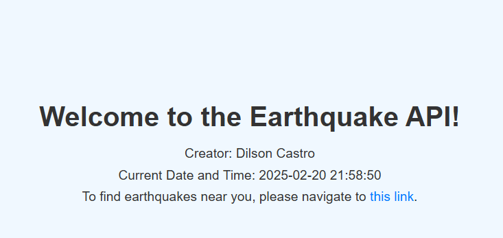
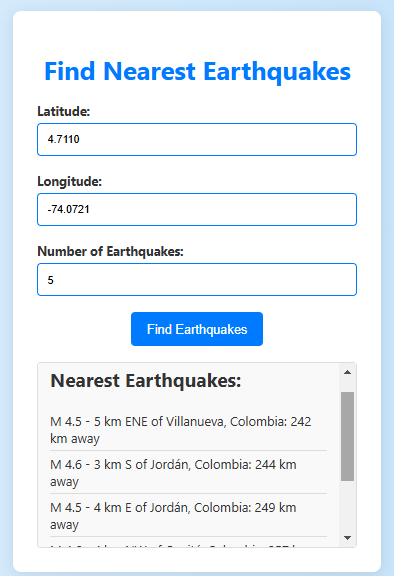

Global Earthquake is a python app to detect nearest earthquakes based on your geolocation.

Based on public API [earthquake.usgs.gov](https://earthquake.usgs.gov/earthquakes/feed/v1.0/summary/all_month.geojson)

## How to run

Clone the project

```bash
https://github.com/Dilson1502/global-earthquake.git
```

Install requirements
```python
pip install -r requirements-devel.txt
```

Replace your top level directory path
```cmd
DIRECTORY_PATH="path/to/top/level/directory/"
```

Run main file
```python
python .\src\api\main.py
```

### Example





